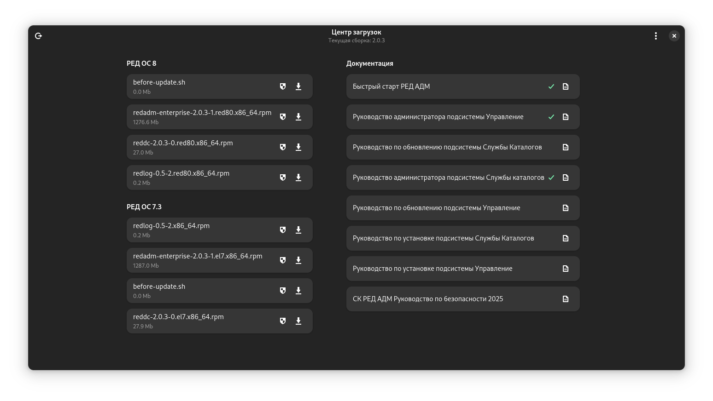
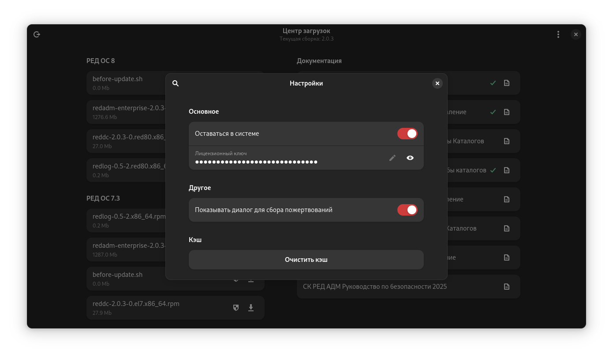

# RED ADM Download center

## Features

- [X] Clean libadwaita look
- [X] Downloading files
- [X] Persistence authentication
- [X] Localization

## Dependencies

- [Python 3.13]()
- [PyGObject](https://pygobject.gnome.org/)
- Libadwaita >= 1.5

## Development

On RED OS prefix should be `/usr`

## Screenshots

